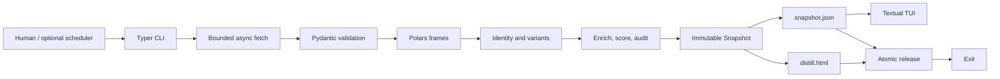

# Analysis Distill: Snapshot Implementation

**Status:** implementation-ready  
**Purpose:** generate an on-demand snapshot of the current AI model landscape  
**Runtime:** Python 3.13  
**Primary command:** `distill run`

This document defines the implementation for the product described in `distill.md`. The product
is a point-in-time report generator, not a continuously maintained model catalog. Each invocation
fetches the current configured sources, analyzes the complete result, writes an HTML report and a
TUI-readable snapshot, and exits.

No database, migration system, persistent cache, or web service is required. The publisher keeps a
rolling two-week JSON history solely to explain changes between snapshots; it is not a canonical
model catalog. An external scheduler may invoke the command, but scheduled execution has no special
behavior and is not necessary to use the product.

## 1. Product Boundary

One invocation performs the following work:

1. Load and validate configuration.
2. Fetch all pages from every enabled current-state source.
3. Validate and normalize source records in memory.
4. Resolve model identities and variants deterministically.
5. Enrich and score the resolved models.
6. Audit source coverage and result integrity.
7. Build all report views from one immutable snapshot object.
8. Render `distill.html` from that object.
9. Serialize `snapshot.json` for the TUI and other tools.
10. Atomically publish both files with a manifest, then exit.

The generated snapshot answers “what is the model landscape now?” It does not infer changes over
time unless a source directly provides a current-window metric.

### 1.1 Included

- Current model metadata, capabilities, licences, providers, pricing, benchmarks, and provenance.
- Artificial Analysis Intelligence Index performance and token-price efficiency rankings; AA
  benchmark-task cost remains a separate metric.
- Artificial Analysis text-to-image, image-to-image, text-to-video, and image-to-video leaderboard
  records, ranked by modality Elo and carrying sample counts, release months, open-weight markers,
  and API cost units.
- An organization Copilot distill using an external model catalog, generic family/effort extraction,
  and top-ten model+thinking combinations ranked by intelligence per Copilot credit.
- LiveBench enrichment inside the existing decision tables, matched to model+thinking variants
  without replacing Artificial Analysis. EvalPlus and DeepSWE are deferred and not active sources.
- Meaningful new Hugging Face models using source dates and an explicit adoption/noise heuristic.
- Primary views are top-ten Artificial Analysis performance, top-ten weighted token-price efficiency,
  top-ten meaningful-new Hugging Face releases, and a top-ten organization Copilot distill. Metadata
  views remain secondary. Artificial Analysis task cost is shown separately and is not token pricing.
- A self-contained HTML report.
- A Textual TUI that reads the generated snapshot without network access.
- Optional invocation by cron, systemd, CI, or another process using the same command.

### 1.2 Excluded

- Persistent model records or source assertions.
- Long-term history beyond the rolling two-week report window.
- Previous-run joins, rank deltas, movers, sparklines, or trend forecasting.
- Locally derived `first_seen_at`, download velocity, or historical heat.
- Incremental fetch cursors, conditional-request caches, stale-data fallback, and backfills.
- Pipeline checkpoints, resume, migration, and database recovery.
- A built-in daily schedule, daemon, API server, or multi-user service.

## 2. Architecture



All analysis state belongs to the current process. Durable outputs are the latest root JSON/HTML
artifacts plus a rolling two-week history of JSON snapshots. A failed invocation leaves the latest
published release untouched, and retained history is never used as analysis input.

## 3. Technology Stack

| Concern | Choice | Why |
|---|---|---|
| Runtime | Python 3.13 | Fast implementation and strong data/HTTP ecosystem |
| Packaging | `uv` + `hatchling` | Fast locked installs with little configuration |
| HTTP | `httpx` | Async pagination, streaming, HTTP/2, explicit limits |
| Retries | `tenacity` | Bounded and testable transient-failure policy |
| Validation | Pydantic v2 | Strict source, configuration, and snapshot contracts |
| Settings | `pydantic-settings` | Typed environment and CLI overrides |
| Analysis | Polars | Efficient joins, grouping, percentiles, and stable sorting |
| Identity candidates | RapidFuzz | Fast conservative name matching |
| Feeds | `feedparser` | Mature RSS/Atom support |
| CLI | Typer + Rich | Typed commands and useful terminal progress |
| HTML | Jinja2 + vanilla JavaScript | One offline file without a frontend build |
| TUI | Textual | Rich terminal viewer in the same language |
| Tests | pytest + Hypothesis + respx | Unit, property, and HTTP fixture coverage |
| Browser validation | Playwright | Offline, CSP, XSS, and accessibility checks |
| Quality | Ruff + mypy + pip-audit | Formatting, typing, linting, dependency audit |

Commit `uv.lock` and use `uv sync --frozen`. Do not add SQLite, DuckDB, SQLAlchemy, Alembic,
PostgreSQL, FastAPI, APScheduler, React, a workflow engine, or a message broker.

Polars is the only analytical engine. At the expected scale, it avoids custom Python joins while
remaining entirely in process. If measurements show that plain Python is faster to start and the
record count stays small, Polars can be replaced behind the analysis contracts without changing
the snapshot format.

## 4. Repository Layout

```text
analysis-distill/
├── pyproject.toml
├── uv.lock
├── config/
│   ├── app.yaml
│   ├── sources.yaml
│   ├── benchmarks.yaml
│   ├── scoring.yaml
│   ├── licences.yaml
│   ├── hardware.yaml
│   ├── views.yaml
│   └── presentation.yaml
├── data/
│   ├── aliases.yaml
│   └── organisations.yaml
├── schemas/
│   └── snapshot-v1.schema.json
├── src/distill/
│   ├── __init__.py
│   ├── __main__.py
│   ├── cli.py
│   ├── config.py
│   ├── errors.py
│   ├── contracts/
│   │   ├── source.py
│   │   ├── model.py
│   │   ├── score.py
│   │   └── snapshot.py
│   ├── connectors/
│   │   ├── base.py
│   │   ├── client.py
│   │   ├── huggingface.py
│   │   ├── openrouter.py
│   │   └── feeds.py
│   ├── normalise/
│   ├── resolve/
│   ├── enrich/
│   ├── score/
│   ├── views/
│   ├── snapshot/
│   │   ├── builder.py
│   │   ├── codec.py
│   │   └── validation.py
│   ├── render/
│   │   ├── html.py
│   │   ├── templates/report.html.j2
│   │   └── assets/
│   ├── tui/
│   └── publish/
│       └── atomic.py
├── tests/
│   ├── unit/
│   ├── contract/
│   ├── integration/
│   ├── property/
│   ├── surface/
│   ├── security/
│   ├── fixtures/
│   └── golden/
├── out/
  ├── snapshot.json
  ├── distill.html
  ├── manifest.json
  ├── current/
  └── history/YYYY-MM-DD.json
```

The root artifacts are the latest permanent report. `current/` is a regular compatibility copy.
History contains at most one JSON result per calendar day and is retained for 14 days; it is used
only to generate What's New and never as analysis input.

## 5. Package Boundaries

```text
contracts/config
  ↑
normalise/resolve/enrich/score/views
  ↑
connectors/snapshot/render/tui
  ↑
publish
  ↑
cli
```

- Connectors fetch and parse one source; they do not score or merge records.
- Normalization converts source records into a common typed shape.
- Resolution and scoring are pure functions with no network or filesystem access.
- Views operate on the completed in-memory model frame.
- Snapshot building is the only conversion from analysis objects to the public artifact schema.
- HTML and TUI consume the same snapshot contract and do not recompute scores.
- Publication accepts complete bytes and performs no analysis.

Enforce package direction with an import-boundary test.

## 6. Core Contracts

Use frozen strict Pydantic models at external boundaries. Use Polars frames internally only after
validation; never pass arbitrary API dictionaries into analysis code.

```python
class RequestPlan(BaseModel):
    model_config = ConfigDict(frozen=True, strict=True)
    url: AnyHttpUrl
    params: tuple[tuple[str, str], ...] = ()
    page: int


class SourceResult(BaseModel):
    model_config = ConfigDict(frozen=True, strict=True)
    source_id: str
    required: bool
    status: Literal["complete", "failed"]
    fetched_at: datetime
    pages: int
    records: int
    duration_ms: int
    error_category: str | None = None
    error_message: str | None = None


class Connector(Protocol):
    id: str

    async def fetch_all(
        self,
        client: httpx.AsyncClient,
        context: FetchContext,
    ) -> SourceBatch: ...


class Snapshot(BaseModel):
    model_config = ConfigDict(frozen=True, strict=True)
    schema_version: Literal["1"]
    snapshot_id: str
    generated_at: datetime
    generator: GeneratorMetadata
    status: Literal["complete", "degraded"]
    sources: tuple[SourceResult, ...]
    warnings: tuple[str, ...]
    audit: AuditResult
    models: tuple[SnapshotModel, ...]
    views: tuple[SnapshotView, ...]
    summary: SnapshotSummary
```

Every model includes current canonical fields, field-level provenance, confidence, source URLs,
scores, score components, and the IDs of applicable views. Keep records immutable after each
stage; construct a new frame or model collection for transformations.

## 7. Fetch Everything Semantics

“Fetch everything” means fetch every page exposed by every enabled connector for the configured
current-state scope. It does not mean download model weights, private data, unlimited event
history, or arbitrary web search.

The shared fetch client must:

- Use one `httpx.AsyncClient` per invocation.
- Bound global concurrency, per-source concurrency, response size, pages, records, and wall time.
- Follow official pagination until the source reports completion.
- Detect repeated cursors/pages and fail instead of looping.
- Use explicit connect, read, write, pool, and total timeouts.
- Respect source rate limits and `Retry-After`.
- Retry only connection failures, timeouts, `408`, `425`, `429`, and `5xx`.
- Validate every redirect and reject private, loopback, link-local, and metadata addresses.
- Validate MIME type before parsing.
- Record sanitized per-source outcomes for the report.

The source response is retained only for the current invocation. For large sources, spool bounded
response pages to a process temporary directory and delete it on exit. Temporary files are an
implementation detail, not a cache or replay layer.

## 8. Source Failure Policy

Each source is configured as required or optional.

- Required-source failure, rejected schema, or incomplete pagination aborts publication and exits
  `69`.
- Optional-source failure can publish a degraded snapshot with exit `3` only if absolute coverage
  gates still pass.
- Missing data is unknown; never copy facts from the previous release.
- A view dependent on failed data is marked `degraded` or `unavailable`, never shown as an
  authoritative empty list.
- Analysis, audit, rendering, or artifact validation failure exits `4` and retains `out/current`.
- Configuration failure exits `78`; an unexpected failure exits `1`.

Retries and circuit suppression live only for the current invocation. There are no persistent
watermarks, ETags, stale caches, or circuit-breaker records.

## 9. In-Memory Analysis

### 9.1 Normalization

Validate source payloads first, then build one Polars frame per logical entity: source models,
benchmark observations, provider prices, capabilities, and provenance. Define explicit schemas;
reject unexpected nullability or incompatible types rather than relying on inference.

### 9.2 Identity and Variants

Apply the first successful rule:

1. Curated alias from `data/aliases.yaml`.
2. Exact normalized source key.
3. Declared base-model lineage.
4. Structural fingerprint, including architecture and tokenizer identity.
5. RapidFuzz score of at least 92 with identical parameter and variant tuples.
6. Otherwise keep a separate unresolved identity.

Fuzzy names alone never merge models. Base models are roots; quantizations, adapters, LoRAs, and
merges are variants by default. Preserve the evidence and rule used for each identity decision in
the snapshot.

### 9.3 Canonical Fields

Resolve each field independently using field-specific source precedence, direct metadata before
prose extraction, confidence, and deterministic source-ID/hash tie-breakers. Preserve all current
competing assertions in field provenance where their inclusion remains within the artifact budget.

Use source-provided `announced_at`, `weights_published_at`, and `released_at`. Do not invent a
local `first_seen_at` without persistent state. Unknown licences fail closed for commercial-use
filters; unknown origin is `XX`.

### 9.4 Scoring

Score functions receive immutable inputs, configuration, `generated_at`, cohort IDs, and algorithm
versions. They perform no I/O.

For benchmark $b$ in peer cohort $M_b$:

$$
\operatorname{pct}_b(m)=
\frac{|\{m' \in M_b:v_b(m')<v_b(m)\}|}{|M_b|-1}\times100
$$

$$
Q(m)=\frac{\sum_{b\in B(m)}w_b\operatorname{pct}_b(m)}
{\sum_{b\in B(m)}w_b}
$$

- Missing benchmarks are absent, not zero.
- Quality below the configured coverage threshold is provisional.
- Provider pricing uses the current median quote and retains spread/provider count.
- Value uses $V=Q/\max(P_{blend},P_{min})$ with versioned configuration.
- Significance may use source-provided recent-window counts, but not locally computed deltas.
- Heat is omitted unless sources directly provide comparable current-window signals.
- Copilot eligibility remains separate from its weighted score.
- Round before serialization, reject NaN/infinity, and use stable model-ID tie-breakers.

### 9.5 Optional Research

Research is disabled by default. When enabled, it operates only on documents fetched during the
current invocation and may produce cited summaries or low-confidence proposals. It cannot select
identities, licences, canonical facts, filters, scores, or rankings.

Each task has a versioned prompt, bounded inputs, a strict output schema, timeout, token/cost limit,
and citation requirements. Verify citation spans against supplied documents before including a
clearly labelled annotation in the snapshot. Agent output remains separate from deterministic
model fields.

Run web-capable backends as credential-free subprocesses or rootless containers with read-only
inputs, scratch-only writes, resource limits, and enforced egress restrictions. Research failure
produces a warning and cannot block deterministic analysis or publication.

## 10. Snapshot Contract

Publish one release containing:

| File | Purpose |
|---|---|
| `snapshot.json` | Complete machine-readable point-in-time result |
| `distill.html` | Self-contained report built from the same snapshot |
| `manifest.json` | Schema version, filenames, byte sizes, and SHA-256 hashes |

`snapshot.json` contains:

- Schema, generator, configuration, and algorithm versions.
- Snapshot ID and UTC generation timestamp.
- Overall `complete` or `degraded` status.
- Per-source required flag, status, timing, page count, record count, and sanitized failure.
- Audit outcomes and warnings.
- Canonical models, variants, current facts, provenance, confidence, and scores.
- Saved views with ordered model IDs, columns, annotations, and availability.
- Summary counts and truncation metadata.

Use UTF-8 JSON with stable key and collection ordering and explicit `null` values. Reject NaN and
infinity. Publish `schemas/snapshot-v1.schema.json`; the TUI must reject unsupported major versions
with a clear error. Raw source responses, secrets, logs, and previous snapshots are not part of the
contract.

If snapshot size becomes a measured problem, add optional `snapshot.json.zst` alongside the plain
JSON. Keep plain JSON as the default until compression is necessary.

## 11. Views and Surfaces

Validate `views.yaml` into typed `ViewSpec` values. Support allow-listed equality, membership,
ranges, booleans, grouping, stable sorting, limits, and facets. Apply them to Polars frames; never
accept SQL or arbitrary expressions.

Each view stores its ordered model IDs and display annotations in the snapshot. Both surfaces use
those results rather than rerunning ranking logic.

### 11.1 HTML

- Render semantic content server-side with Jinja2 autoescape.
- Inline CSS, JavaScript, and the logical snapshot into one file.
- Remain useful with JavaScript disabled and work from `file://`.
- Use JavaScript only for search, facets, sorting, details, comparison, and export.
- Assign external strings with `textContent`; never render source HTML.
- Use a CSP with no network access and hashes for embedded assets.
- Allow only validated HTTPS outbound links.
- Show source failures, degraded views, generation time, and algorithm/configuration versions.
- Enforce a configured size budget and visibly disclose truncation.

### 11.2 TUI

`distill top` opens `out/snapshot.json`. `distill top --snapshot PATH` opens another compatible
snapshot.

The TUI performs no network access, analysis, or score computation. It supports filtering, stable
sorting, provenance, score explanations, model comparison, responsive columns, ASCII,
`NO_COLOR`, and `--once --plain`. Replace historical freshness/rank panels with the current
invocation's source-status panel. Pressing `r` may reopen `out/current` after another invocation
publishes a new snapshot.

Do not implement automatic refresh timers, database reads, yesterday comparisons, rank deltas,
sparklines, or persisted score-weight editing.

## 12. Atomic Publication

1. Create a same-filesystem staging directory.
2. Serialize `snapshot.json` once from the immutable `Snapshot` object, including What's New.
3. Render the permanent `distill.html` from that object.
4. Write `manifest.json` last with sizes and SHA-256 hashes.
5. Reopen and validate the JSON against its Pydantic model and JSON Schema.
6. Verify manifest hashes and run HTML safety/size checks.
7. Flush the staging directory with `fsync`.
8. Atomically replace root `snapshot.json`, `distill.html`, and `manifest.json`.
9. Store the snapshot in `out/history` and delete history older than 14 days.
10. Refresh the regular `out/current` compatibility directory; it is not a symlink.

If any step fails, remove staging and leave the root artifacts unchanged. Never read the prior
release during analysis; it is used only for the generated change summary.

## 13. CLI

| Command | Purpose |
|---|---|
| `distill run` | Fetch, analyze, and publish one current snapshot |
| `distill run --no-publish` | Build and validate into a temporary output for testing |
| `distill render --snapshot PATH` | Re-render HTML from an existing compatible snapshot |
| `distill top` | Open the current snapshot in the TUI |
| `distill top --snapshot PATH` | Open a selected snapshot |
| `distill inspect MODEL_ID` | Print one model and provenance from a snapshot |
| `distill validate PATH` | Validate snapshot or release integrity |
| `distill sources` | List enabled sources and required/optional status |

`distill run` supports `--config`, `--output`, `--generated-at`, `--source`, `--no-publish`, and
`--log-format`. `--generated-at` exists for deterministic tests and controlled reproduction, not
incremental replay.

| Code | Meaning |
|---:|---|
| `0` | Complete snapshot published |
| `3` | Degraded snapshot published with permitted optional-source failures |
| `4` | Analysis, audit, render, or artifact validation failed; current retained |
| `64` | Invalid command usage |
| `69` | Required source failed or pagination was incomplete |
| `75` | Another publication is in progress |
| `78` | Invalid configuration |
| `1` | Unexpected fatal failure |

Use a short publication lock to prevent two invocations from replacing `current` simultaneously.
Fetching and analysis can occur concurrently in separate processes; only publication is serialized.

## 14. Audit Gates

Before publication, verify:

- Every required source completed all pages.
- Optional failures stay within configured absolute coverage thresholds.
- Input schemas and record counts are plausible.
- Identity uniqueness and lineage contain no cycles.
- Unresolved and ambiguous identity rates remain below configured limits.
- Benchmark cohorts and score coverage meet minimums.
- Scores are finite, bounded, explainable, and stably ordered.
- Licence-sensitive views contain no unknown or disallowed entries.
- Every view references an existing model and declares availability.
- JSON Schema, artifact hashes, HTML CSP, and size checks pass.
- HTML and TUI fixture projections agree on values and ordering.

The audit uses absolute thresholds configured for the current invocation. It cannot compare against
a previous run because historical state is outside the product boundary.

## 15. Configuration and Secrets

```yaml
runtime:
  output_dir: ./out
  max_run_time: 30m
  max_memory_mb: 1024

fetch:
  global_concurrency: 8
  per_source_concurrency: 2
  max_response_mb: 50
  max_pages_per_source: 10000
  retries: 4

sources:
  huggingface:
    enabled: true
    required: true
  openrouter:
    enabled: true
    required: true
  feeds:
    enabled: true
    required: false

audit:
  minimum_resolution_rate: 0.95
  minimum_quality_coverage: 0.35
  maximum_ambiguous_identities: 100

render:
  html_max_bytes: 5242880
  max_models: 5000
```

Load defaults, YAML, environment, then CLI overrides. Reject duplicate keys, YAML tags, unknown
critical fields, invalid limits, and secrets in YAML. Load secrets from environment variables only
and redact them from errors and logs.

## 16. Logging and Security

Emit structured JSONL to stderr or human-readable Rich progress when interactive. Include run ID,
stage, source, duration, page/record counts, retry category, analysis counts, artifact sizes, and
final exit code. Do not persist a run database. The completed snapshot contains only its sanitized
source summary and audit result.

Security requirements:

- Prefer official APIs; scrape only with documented permission.
- Never download model weights or collect user PII.
- Bound network, memory, response, page, record, and render sizes.
- Validate redirect targets and block SSRF destinations.
- Treat every external string as hostile.
- Strip terminal controls and bidi overrides.
- Escape HTML and use no CDN, analytics, remote fonts, or report network requests.
- Preserve current-source attribution and provenance for published values.
- Run dependency and secret scans in CI.

## 17. Testing

| Area | Acceptance |
|---|---|
| Connectors | Recorded full-pagination fixtures; normal CI has no live network |
| Failure handling | Timeout, malformed page, repeated cursor, and partial pagination cases |
| Validation | No silent source-field coercion or unknown critical fields |
| Identity | Reviewed corpus reaches at least 99% merge precision; recall reported |
| Scoring | Bounds, monotonicity, missing-data behavior, stable ties, no NaN |
| Determinism | Fixed inputs and `--generated-at` produce byte-identical artifacts |
| Snapshot | Pydantic and JSON Schema round-trip compatibility |
| Publication | Failure injection before every write/rename leaves current intact |
| Source matrix | Required failure aborts; allowed optional failure publishes degraded |
| HTML | Golden, CSP, XSS, accessibility, size, and zero-network Playwright tests |
| TUI | Snapshots at 80x24, 120x40, and 200x60; ASCII/no-color support |
| Parity | HTML and TUI display identical values and view order |
| Performance | Full fixture run remains within time and peak-memory budgets |

Schedule optional live connector canaries to detect API schema drift. They are maintenance tests,
not part of producing or storing the model snapshot.

## 18. Delivery Plan

### Phase 1: Snapshot Contract

Implement packaging, configuration, source/result contracts, snapshot schema, manifest, error
taxonomy, and deterministic JSON codec.

**Done when:** a hand-built snapshot validates through Pydantic and JSON Schema, round-trips
without changes, and renders a minimal HTML page and TUI table.

### Phase 2: Fetch and Normalize

Implement the shared bounded HTTP client, complete pagination, Hugging Face and OpenRouter
connectors, source summaries, and explicit Polars schemas.

**Done when:** recorded fixtures fetch all pages; repeated cursors fail; required/optional failure
semantics pass; no source data survives process exit except in the final snapshot.

### Phase 3: Resolve and Score

Implement aliases, name parsing, lineage, fingerprints, unresolved identities, canonical fields,
benchmark cohorts, quality, value, significance, and Copilot suitability.

**Done when:** identity precision meets its gate; unknown licences fail closed; fixed current inputs
produce deterministic, explainable scores and views.

### Phase 4: Publish HTML

Implement views, audit, Jinja2 report, manifest verification, and atomic release replacement.

**Done when:** `distill run` publishes a complete offline report; injected failures preserve
`out/current`; source status and degraded views are visible; artifacts satisfy size limits.

### Phase 5: TUI and Hardening

Implement the snapshot-only Textual viewer, provenance inspection, filters, responsive layouts,
plain output, security tests, and packaged installation.

**Done when:** HTML/TUI parity passes; supported terminals do not overflow; hostile content cannot
inject HTML or terminal controls; a clean host can install and run the tool from the lockfile.

## 19. Performance Targets

Measure on a four-core machine with SSD storage:

| Operation | Target |
|---|---:|
| CLI startup | under 300 ms |
| Analyze and score 25,000 models | under 15 s |
| Build all views | under 2 s |
| TUI load and first paint | under 500 ms |
| Full invocation excluding source throttling | under 5 min |
| Peak resident memory | under 1 GiB |
| Publication replacement | under 1 s |

Source rate limits take precedence over total invocation time. Measure before optimizing or adding
another storage/query technology.

## 20. Definition of Done

The implementation is complete when:

- `distill run` fetches every page from all enabled sources and exits after publication.
- There is no database, migration, cache, checkpoint, or historical dependency.
- Required-source incompleteness prevents publication; permitted optional failure is explicit.
- One immutable snapshot drives both HTML and TUI values.
- Identity and scoring are deterministic, versioned, bounded, and explainable.
- `snapshot.json` validates against the published versioned schema.
- `distill.html` is self-contained, offline, accessible, and safe for hostile source strings.
- Publication is atomic and failure leaves the prior completed release untouched.
- The TUI reads only the snapshot and performs no network or analysis work.
- Fixed fixtures produce byte-identical output with a pinned generation time.
- Time, memory, security, browser, and terminal acceptance gates pass.
- Optional scheduling invokes plain `distill run` and adds no product state or behavior.
